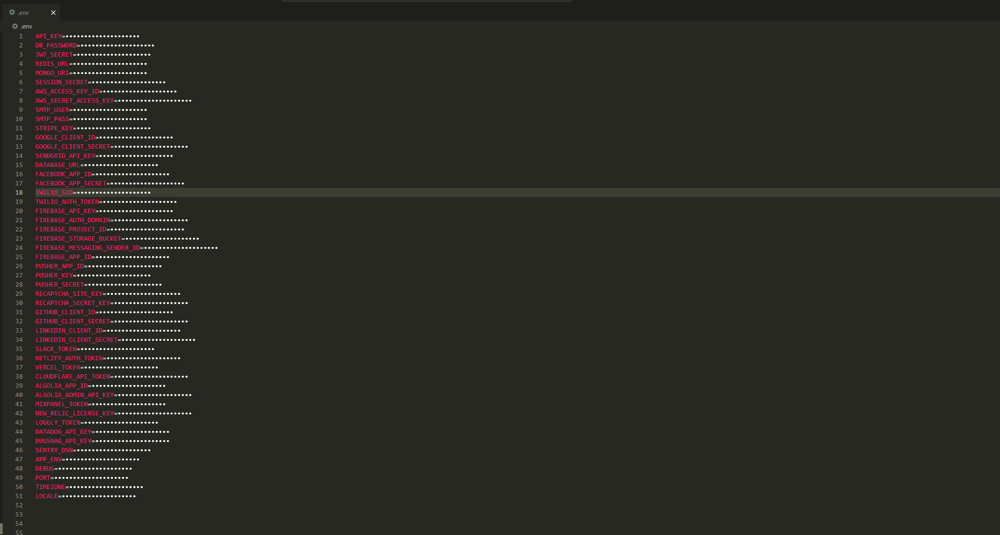

# env-mask

A VS Code extension that automatically masks sensitive values in environment files to protect secrets from shoulder surfing and accidental exposure.


_Environment variables with values safely masked_


_Click on any masked value to temporarily reveal it_

## What it does

**env-mask** automatically detects and masks sensitive values in `.env` files, replacing them with configurable masking characters (like `••••••••••`).
<br>
This somewhat prevents accidental flashes of API keys, database passwords, and other secrets for example when:

- Working in public spaces
- Taking screenshots

## Features

- **Masking**: Instantly masks values in `.env` files when opened
- **Click to Reveal**: Click on any masked value to temporarily reveal it
- **Auto-Hide**: Automatically re-mask revealed values after a configurable delay
- **Customizable**: Configure masking character, length strategy, and file patterns
- **Multi-File Support**: Works with `.env`, `.env.local`, `.env.production`, etc.
- **Blacklist Support**: Exclude specific files or patterns from masking
- **Real-time**: Instantly applies to newly opened files

## Installation

1. Open VS Code
2. Go to Extensions (Ctrl+Shift+X)
3. Search for "env-mask"
4. Click Install

Or install from the command line:

```bash
code --install-extension env-mask
```

## Usage

### Basic Usage

1. **Open any `.env` file** - values are automatically masked
2. **Click towards the tail of a masked value** to reveal it temporarily
3. **Use Command Palette** (Ctrl+Shift+P) for additional commands:
   - `env-mask: Toggle Masking feature on/off`
   - `env-mask: Reveal All Values`
   - `env-mask: Mask All Values`

### Supported File Patterns

By default, the extension works with:

- `.env`
- `.env.local`
- `.env.development`
- `.env.production`
- `.env.test`

## Configuration

Access settings via File → Preferences → Settings, then search for "env-mask":

### Masking Character

```json
"env-mask.eb_maskingCharacter": "•"
```

Character used for masking (default: `•`)

### Masking Strategy

```json
"env-mask.eb_maskingLengthStrategy": "eb_fixedLength"
```

- `eb_fixedLength`: Use a fixed number of characters
- `eb_proportionalLength`: Match the original value length

### Fixed Mask Length

```json
"env-mask.eb_fixedMaskLength": 8
```

Number of masking characters when using fixed length strategy (5-100)

### Auto-Hide Delay (ms)

```json
"env-mask.eb_autoHideDelay": 5000
```

Milliseconds before auto-hiding revealed values (0 = no auto-hide, max: 10000)

### File Patterns

```json
"env-mask.eb_enabledFilePatterns": [
  ".env",
  ".env.local",
  ".env.development",
  ".env.production",
  ".env.test"
]
```

File patterns where masking should be enabled

### Blacklisted Files

```json
"env-mask.eb_blacklistedFiles": [
  "public.env",
  "*.example.env"
]
```

File patterns to exclude from masking (supports wildcards)

## Commands

| Command                                   | Description                         |
| ----------------------------------------- | ----------------------------------- |
| `env-mask: Toggle Masking feature on/off` | Enable/disable the entire extension |
| `env-mask: Reveal All Values`             | Show all values in the current file |
| `env-mask: Mask All Values`               | Hide all values in the current file |

The original file content is never modified - masking is purely visual through VS Code's decoration system.
This also means that the extension has limitations that are addressed below.

## Known Limitations

- **Startup Delay**: Takes 3-5 seconds to activate when VS Code starts with `.env` files open
- **Tab Switching**: Brief exposure when switching between tabs
- **Cursor Positioning**: Some edge cases with cursor placement at line endings
- **Click Detection**: Click detection area could be more precise

See [limitations.md](limitations.md) for detailed information.

## Development

```bash
npm install
npm run compile
```

### Testing

```bash
# Press F5 to launch extension development host
```

### Building

```bash
npm run vscode:prepublish
```

## File Format Support

The extension recognizes standard `.env` file format:

```bash
#comments are ignored
API_KEY=your-secret-here          #this value gets masked
DB_PASSWORD=super-secret-pwd      #this too
PORT=3000                         #and this

#empty lines are ignored, comments as well

ANOTHER_SECRET=masked-value       #this as well
```

**Supported:**

- Standard `KEY=VALUE` format
- Comments (starting with `#` or `//`)
- Empty lines
- Various quote styles in values

**Not supported by design** :

- `export` statements
- Multi-line values
- Complex shell substitutions

## Security Note

This extension provides **visual** security by hiding values from view.

- Never commit real secrets to version control
- Use proper secret management systems in production
- Consider this extension as protection against accidental exposure, not a security measure against malicious access
